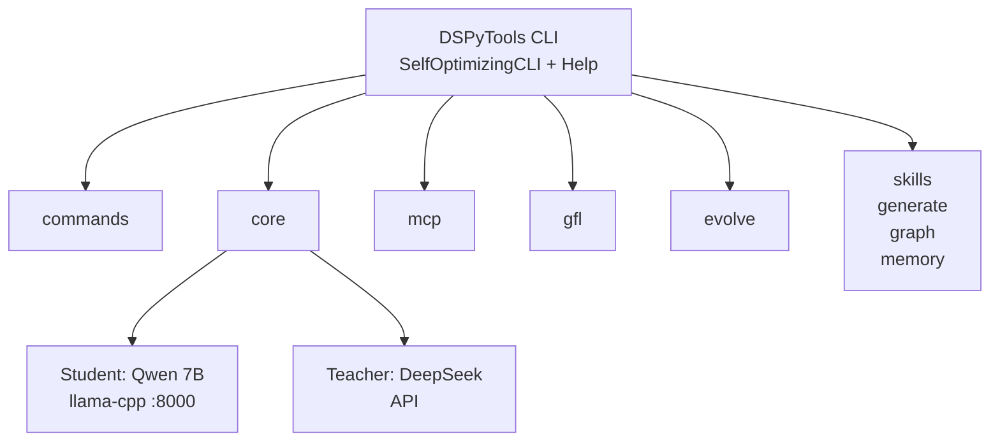
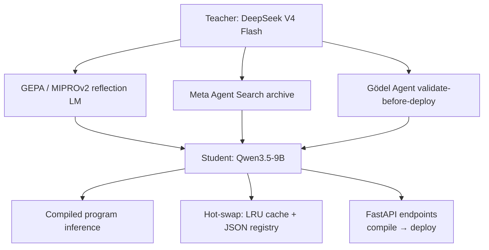
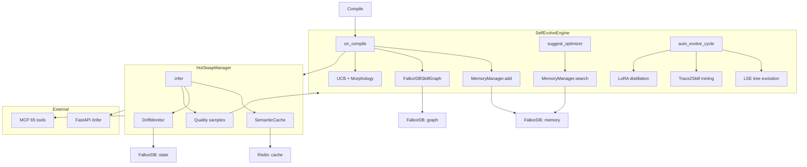
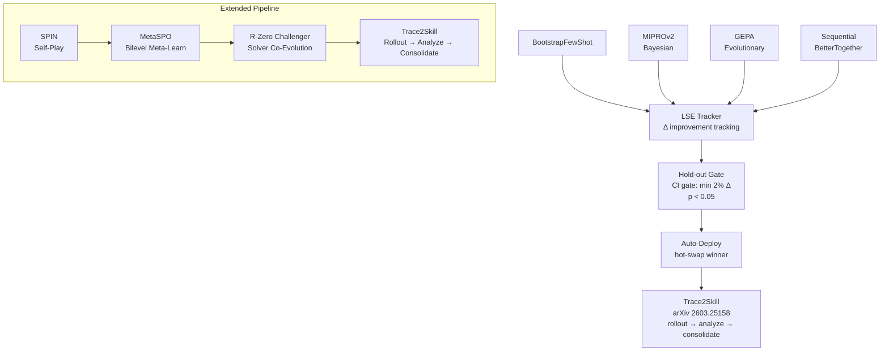
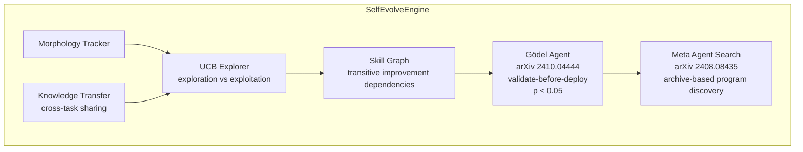
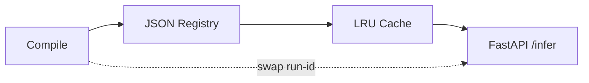
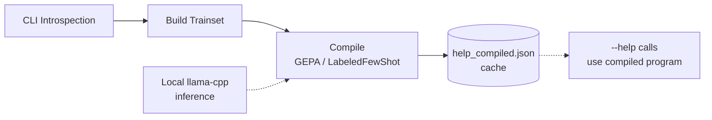

# DSPyTools — Self-Evolving DSPy CLI

**23 command groups · 110+ subcommands · 96 source files · 20+ optimizers · 11 arXiv paper implementations**


A production-grade, self-evolving CLI for DSPy program management — featuring hot-swap inference,
MCP agent interoperability, a Generative Feedback Loop (GFL) pipeline, skills system,
llms.txt generation, and full MLflow experiment tracking.

**All subsystems integrated via SSOT (Single Source of Truth) pattern with fail-fast imports.**

Built on **DSPy 3.3.0b1**, runs on **Qwen3.5-9B** (student+teacher inference via llama-cpp-server),
with **DeepSeek V4 Flash** as an optional teacher LM for heavy optimization.

---

## Architecture



### Teacher-Student Architecture



### Full System Integration (SSOT)

Every subsystem is wired together — no disconnected islands, no duplicated storage:



| Subsystem | SSOT | Wired Into |
|-----------|------|------------|
| FalkorDB graph | `FalkorDBSkillGraph` | SelfEvolveEngine, registry, MCP |
| Semantic cache | `get_semantic_cache()` | `HotSwapManager.infer()` |
| Memory | `get_memory_manager()` | `on_compile()`, `suggest_optimizer()` |
| SkillGraph | FalkorDB (JSON fallback) | SelfEvolveEngine |
| Drift monitor | `get_drift_monitor()` | `HotSwapManager.infer()` |
| LSE evolution | `LSESelfEvolveModule` | `auto_evolve_cycle()` |
| Trace2Skill | `SkillConsolidator` | `consolidate_skills()` |
| LoRA | `lora extract` / `distill run` | `auto_evolve_cycle()` |

**Fail-fast pattern:** No try/except around imports or DSPy module constructors. Only runtime operations (Redis down, network timeout) use graceful degradation.

---

## Features

### 🚀 CLI — 23 Command Groups

| Group | Subcommands | Description |
|-------|-------------|-------------|
| `configure` | 5 | API keys, LM config, adapters, DSPy settings, cache |
| `signature` | 5 | Create, list, show, edit, delete DSPy signatures |
| `module`  | 5 | Create, list, call, show, delete DSPy modules |
| `run`     | 15 | 12 inference strategies + list + retrieve + knn |
| `compile` | 22 | 20 optimizers + submit/status/list/cancel |
| `agent`   | 4 | New, list, run, delete ReActV2 agents |
| `tool`    | 6 | List, show, from-mcp, inspect, python-interpreter, history |
| `evaluate`| 2 | Run evaluation, list available metrics |
| `data`    | 3 | List, load, preview datasets |
| `distill` | 4 | LoRA distillation pipeline (run, list-frameworks, stats, prepare-colab) |
| `inspect` | 7 | History, config, cache, tools, experimental, version |
| `lora`    | 10 | LoRA adapter management (load, unload, list, chat, test, health, discover, extract, evaluate, train) |
| `mcp`     | 3 | List MCP tools, serve (stdio/SSE), config |
| `server`  | 8 | Enable/disable, start/stop/restart, status, swap, list |
| `self`    | 7 | Optimize, status, evolve, distill, ucb-status, ucb-reset, watch |
| `gfl`     | 10 | Synthesize, meta-optimize, decompose, ab-test, consolidate, spin, lse, gepa, opsd, status |
| `skills`  | 10 | List, create, search, compile, auto-optimize, show, find, discover, categories, generate-from-run |
| `generate`| 4 | llms.txt generation, batch eval, MCP git exploration, cache warmup |
| `pipeline`| 3 | Compose, run, list multi-step compile pipelines |
| `export`  | 3 | Package, list, info program exports |
| `compare` | 1 | Side-by-side program comparison |
| `doctor`  | 1 | System diagnostics, environment check, dependency audit |
| `graph`   | 14 | Query, stats, skill-tree, lineage, migrate, redis, search, status, dependents, add-dependency, record-program, flush, benchmark, cascade |

### 🔧 20+ DSPy Optimizers

| Optimizer | Type | Description |
|-----------|------|-------------|
| `knn` | Few-shot | KNN embedding-based example selection |
| `mipro` | Bayesian | MIPROv2 — Bayesian optimization of instructions + demos |
| `gepa` | Evolutionary | GEPA — reflective prompt evolution with Pareto sampling |
| `copro` | Evolutionary | COPRO — coordinate proposal optimization |
| `simba` | Iterative | SIMBA — minimal Bayesian optimization |
| `bootstrap-few-shot` | Few-shot | BootstrapFewShot with demo bootstrapping |
| `bootstrap-few-shot-random` | Few-shot | BootstrapFewShotWithRandomSearch |
| `bootstrap-few-shot-optuna` | Few-shot | BootstrapFewShotWithOptuna |
| `labeled-few-shot` | Few-shot | LabeledFewShot with k examples |
| `infer-rules` | Rule | InferRules — rule induction |
| `better-together` | Composition | GEPA sub-optimizer composition |
| `ensemble` | Ensemble | Multi-module majority voting ensemble |
| `finetune` | Fine-tune | BootstrapFinetune — distill prompts into weights |
| `grpo` | RL | Group Relative Policy Optimization |
| `avatar` | Iterative | AvatarOptimizer |
| `distill` | Distillation | Teacher-student distillation (GEPA → BootstrapFinetune) |
| `gfl` | Pipeline | 4-way comparison (BFS → MIPROv2 → GEPA → Sequential) |

### 🔬 GFL Pipeline (Generative Feedback Loop)

All LLM-driven stages use **compilable DSPy modules** — compile any paper implementation:  
`dspytools compile gepa ErrorAnalystModule trainset.json`

| Paper | Compilable Module | Compile As |
|-------|-------------------|------------|
| Trace2Skill (arXiv 2603.25158) | `ErrorAnalystModule`, `SuccessAnalystModule`, `MergeOperatorModule` | `dspytools compile gepa ErrorAnalystModule trainset.json` |
| LSE (arXiv 2603.18620) | `LSESelfEvolveModule` | `dspytools compile mipro LSESelfEvolveModule trainset.json` |
| SPIN (arXiv 2401.01335) | `SpinDiscriminateModule` | `dspytools compile gfl --halving SpinDiscriminateModule trainset.json` |
| Purified OPSD (arXiv 2607.02234) | `PurifiedOPSDModule` | `dspytools compile gepa PurifiedOPSDModule trainset.json` |



### 🧬 Self-Evolving Engine



### 🔄 Hot-Swap Inference



- **Zero-downtime deployment**: compile → deploy lifecycle
- **Thread-safe refcounting**: concurrent `infer()` calls protected by `threading.Lock`, `swap(wait_for_drain=True)` blocks until in-flight requests complete
- **Warm swap**: `POST /swap/{id}?warm=true` — loads, verifies via test inference, then swaps (signature-aware test input construction)
- **LRU cache**: compiled programs cached for fast inference (max 16 loaded)
- **JSON registry**: persistent metadata storage
- **FastAPI endpoints**: `POST /infer`, `POST /swap/{run_id}?warm=true`, `GET /programs`

### 🔌 MCP Server — Agent Interoperability

65 tools exposed via MCP (Model Context Protocol) for AI assistants — each with annotations (readOnlyHint, destructiveHint, idempotentHint, openWorldHint) and descriptive schemas:

| Category | Tools |
|----------|-------|
| **Programs** | `list_programs`, `swap_program`, `infer`, `get_program_metadata`, `stream_infer` |
| **Registry** | `list_signatures`, `list_modules`, `list_compiled_runs`, `list_optimizers`, `compile_stats` |
| **Compile** | `compile_optimizer`, `compile_cost`, `holdout_status` |
| **Skills** | `skills_list`, `skills_search`, `skills_external_search` |
| **Drift** | `drift_status`, `drift_history` |
| **Self** | `self_status` |
| **MLflow** | `mlflow_status` |
| **DSPy** | `inspect_history` |
| **Evaluate** | `evaluate` |
| **GFL** | `gfl_synthesize`, `gfl_run_halving`, `challenger_solver`, `meta_prompt_learn`, `opsd_purify` |
| **Validation** | `validate_deploy`, `archive_search` |
| **Sandbox** | `sandbox_execute`, `sandbox_stats` |
| **Trace2Skill** | `trace2skill_evolve` |
| **Paper Optimizers** | `spin_optimize`, `lse_explore`, `gepa_frontier`, `opsd_purify` |
| **Diagnostics** | `doctor` |
| **Cache** | `cache_stats`, `cache_invalidate` |
| **Agent** | `agent_run` |
| **Generate** | `generate_llms_txt` |
| **LoRA** | `lora_list_adapters`, `lora_load_adapter`, `lora_unload_adapter` |
| **Graph** | `graph_query`, `graph_skill_tree`, `graph_program_lineage`, `graph_stats` |
| **Memory** | `memory_add`, `memory_search`, `memory_get_all`, `memory_delete` |
| **Semantic Cache** | `cache_check`, `cache_store`, `cache_stats`, `cache_clear` |

Compatible with **OpenCode**, **Claude Desktop**, **Codex**, and any MCP client.

### 🧠 Skills System

- **BM25 + embedding hybrid search** — keyword + semantic retrieval
- **Auto-generation** — compiled programs → Agent Skills format
- **Full lifecycle** — create, compile, auto-optimize, search, delete
- **Agent Skills compatible** — standard SKILL.md + program.json format

### 📄 llms.txt Generation

- **RepositoryAnalyzer** (5-stage pipeline) — analyzes repo structure, reads README, explores packages, generates documentation
- **Batch evaluation** — quality metrics against ground truth examples
- **MCP git exploration** — deep repo analysis via ReActV2 agent with git-mcp tools
- **BAML adapter support** — optional BAML integration

### 🤖 Self-Optimizing `--help`

The help system is itself a compiled DSPy program:



- First run: `dspytools self optimize` compiles the help module
- Subsequent `--help` calls use the compiled program
- Cache at `~/.config/dspytools/help_compiled.json`
- Force re-compile with `dspytools self optimize --force`

---

## New Features

### 💰 Cost Tracking
Token counting and cost estimation for every compile and inference call. Track LM usage by model, run, or pipeline step.

### 📉 Drift Detection
Monitor compiled programs for quality degradation over time. Get alerted when scores drop below baseline thresholds.

### 🚧 Holdout Gate
Programmatic enforcement of Invariant 5 — holdout data is split before any compile call and never seen by the optimizer. All GFL, compile, and evaluate commands enforce this gate. GFL pipeline splits holdout BEFORE optimizer runs, then uses the reserved holdout for SPRT post-compile validation.

### 📊 SPRT Post-Compile Validation
After the GFL pipeline selects the best optimizer, it runs Sequential Probability Ratio Test (SPRT, α=0.05, β=0.20) on the reserved holdout set. Early termination on clear wins (typically ~12 examples). If SPRT rejects the candidate, the pipeline falls back to baseline — never deploys a regressor.

### 👁️ Drift Watch Daemon
Continuous quality monitoring with webhook alerts:

```bash
# Single check
dspytools self watch --once

# Continuous monitoring with webhook
dspytools self watch --interval 3600 --alert-url https://hooks.example.com/drift
```

### 📈 Graph Benchmark & Cascade
Benchmark FalkorDB query latency (p50/p95/p99) and trace downstream re-optimization cascades:

```bash
dspytools graph benchmark --queries 10 --warmup 3
dspytools graph cascade <skill> --depth 2 --no-dry-run
```

### 🌅 Cache Warmup
Pre-compute real composite cache keys for local repositories to eliminate cold-start latency:

```bash
dspytools generate warmup /home/user/repos/numpy /home/user/repos/pandas
```

### ⚡ AST-Based Caching
Analysis cache (`generate/cache.py`) caches repository analysis results keyed by file dependency hashes. Eliminates redundant recomputation across generate, explore, and pipeline commands.

### 🧠 FalkorDB Graph Database
O(1) graph traversal for skill dependencies and program lineage. Sub-140ms p99 latency (335x faster than Neo4j), <100MB memory footprint.

- **Skill dependency graph** — track which skills depend on which, cascade improvements
- **Program lineage tracking** — full ancestry chains from compilation
- **Cypher queries** — full FalkorDB/Cypher support for complex graph queries
- **Migration tools** — import existing JSON data into FalkorDB

### 🔍 Semantic Cache (RedisVL)
Cache LLM responses by semantic similarity to reduce API costs by ~70%.

- **Cosine similarity matching** — finds semantically similar prompts
- **Configurable threshold** — tune precision vs recall
- **TTL expiration** — auto-invalidate stale entries
- **Cache statistics** — track hit rate and memory usage

### 🧠 FalkorDB-native Persistent Memory

FalkorDB-native memory layer with automatic entity extraction, deduplication, semantic search, and graph-based relationships. No mem0 dependency — uses FalkorDB graph + Redis vector embeddings directly.

- **Automatic entity extraction** — memories indexed by entities, tagged, with graph relationships
- **Deduplication** — content hash prevents duplicate memories
- **Conflict resolution** — merges contradictory information via entity reconciliation
- **Semantic search** — two-tier: FalkorDB native vector index (O(log N)) + graph traversal
- **Multi-tenant** — user_id, agent_id, run_id isolation
- **Integrated into SelfEvolveEngine** — `on_compile()` stores lessons, `suggest_optimizer()` searches memories

### 🐳 Redis Stack Infrastructure
Single Docker container with all data infrastructure:

- **FalkorDB** — graph database (Cypher queries + native vector index via `db.idx.vector.queryNodes`)
- **Redis** — core data structures (caching, exact-match lookup, pub/sub)

```bash
# Start Redis Stack
docker compose -f docker-compose.redis.yml up -d

# Migrate existing data
dspytools graph migrate --target all

# Check status
dspytools graph status
```

---

## Quick Start

```bash
# 1. Install
git clone <repo>
cd dspytools
uv sync
cp .env.example .env   # Set DEEPSEEK_API_KEY

# 2. Configure student + teacher models
dspytools configure lm set "unsloth/Qwen3.5-9B-GGUF" \
  --api-base http://localhost:11434/v1 --role student
dspytools configure lm set "deepseek/deepseek-v4-flash" --role teacher

# 3. Create a module
dspytools module new TweetGenerator "topic: str -> tweet: str"

# 4. Compile a program
dspytools compile mipro TweetGenerator trainset.json

# 5. Run inference
dspytools run predict "topic: str -> tweet: str" -i topic="DSPy frameworks"

# 6. Generate llms.txt
dspytools generate llms-txt . --local

# 7. Run diagnostics
dspytools doctor

# 8. Compare two compiled programs
dspytools compare <run-a> <run-b>

# 9. Run multi-step pipeline
dspytools pipeline compose pipeline.json --run

# 10. Export a compiled program
dspytools export program <run-id> --format json

# 11. Run MCP server (for AI assistant integration)
dspytools mcp serve --transport stdio

# 12. Manage LoRA adapters
dspytools lora list
dspytools lora load super ~/.config/dspytools/adapters/super
dspytools lora test super
dspytools lora health

# 13. Run distillation pipeline (creates training data for LoRA)
dspytools distill list-frameworks
dspytools distill run --dry-run
dspytools distill stats

# 16. Stage files for Colab LoRA training
dspytools distill prepare-colab --adapter super --rank 64
```

### OpenCode / Claude Desktop MCP Configuration

```json
{
  "mcpServers": {
    "dspytools": {
      "command": "uv",
      "args": ["run", "dspytools", "mcp", "serve", "--transport", "stdio"]
    }
  }
}
```

---

## Command Reference

### 📋 Configuration & Setup (`configure`)

```bash
dspytools configure key set <provider> <key>    # Set API key
dspytools configure key list                    # List configured keys
dspytools configure lm set <model> [--role]     # Set LM (student/teacher)
dspytools configure lm list                     # List configured LMs
dspytools configure adapter set <name> <type>   # Set adapter
dspytools configure cache enable/disable/clear  # Manage DSPy cache
dspytools configure dspy set/show <setting>     # Configure DSPy backend
dspytools configure dspy optimize               # Auto-optimize DSPy settings
```

### ✍️ Signatures & Modules

```bash
dspytools signature new <name> <signature>      # Create signature
dspytools signature list                        # List all signatures
dspytools signature show <name>                 # Show signature
dspytools signature manipulate <name>           # Edit signature

dspytools module new <name> <signature>          # Create module
dspytools module list                           # List modules
dspytools module call <name> [inputs]           # Call module directly
dspytools module delete <name>                  # Delete module
```

### 🏃 Inference (`run`)

```bash
dspytools run predict <signature> -i <key>=<val>    # Standard prediction
dspytools run cot <signature> -i <key>=<val>         # Chain-of-thought
dspytools run react <signature> -i <key>=<val>       # ReAct agent
dspytools run react-v2 <signature> -i <key>=<val>    # ReActV2 agent
dspytools run pot <signature> -i <key>=<val>         # Program-of-Thought
dspytools run code-act <signature> -i <key>=<val>    # CodeAct agent
dspytools run rlm <signature> -i <key>=<val>         # ReRank LM
dspytools run best-of-n <signature> -i <key>=<val>   # Best-of-N sampling
dspytools run refine <signature> -i <key>=<val>      # Progressive refinement
dspytools run multi-chain <signature> -i <key>=<val> # Multi-chain reasoning
dspytools run parallel <signature> -i <key>=<val>    # Parallel execution
dspytools run retrieve <signature> -i <key>=<val>    # Retrieval-augmented
dspytools run list                                   # List available run types
```

### ⚡ Compilation (`compile`)

```bash
# Simple optimizers (synchronous)
dspytools compile knn <module> <trainset> --k 2
dspytools compile mipro <module> <trainset>
dspytools compile gepa <module> <trainset>
dspytools compile copro <module> <trainset>
dspytools compile simba <module> <trainset>
dspytools compile labeled-few-shot <module> <trainset>
dspytools compile bootstrap-few-shot <module> <trainset>
dspytools compile bootstrap-few-shot-random <module> <trainset>
dspytools compile bootstrap-few-shot-optuna <module> <trainset>
dspytools compile infer-rules <module> <trainset>

# Advanced optimizers
dspytools compile better-together <module> <trainset>
dspytools compile ensemble -m module1 -m module2
dspytools compile finetune <module> <trainset>

# RL-based
dspytools compile grpo <module> <trainset>

# Agent-based
dspytools compile avatar <module> <trainset>

# Distillation (teacher → student)
dspytools compile distill <module> <trainset>

# GFL Pipeline (4-way comparison)
dspytools compile gfl <module> <trainset>
dspytools compile gfl <module> <trainset> --single mipro

# Async job management
dspytools compile submit <optimizer> <module> <trainset>
dspytools compile status <job-id>
dspytools compile list
dspytools compile cancel <job-id>
```

### 🧪 Agents (`agent`)

```bash
dspytools agent new <name> <signature>          # Create ReActV2 agent
dspytools agent list                            # List agents
dspytools agent run <name>                      # Run agent
dspytools agent delete <name>                   # Delete agent
```

### 🛠 Tools (`tool`)

```bash
dspytools tool list                             # List DSPy tools
dspytools tool show <name>                      # Show tool details
dspytools tool from-mcp <server> <tool>         # Import MCP tool
dspytools tool inspect <name>                   # Inspect tool internals
dspytools tool python-interpreter               # Start Python sandbox
```

### 📊 Evaluation (`evaluate`)

```bash
dspytools evaluate run <module> <devset>         # Evaluate module
dspytools evaluate list-metrics                  # List available metrics
```

### 📊 Dataset Management (`data`)

```bash
dspytools data load <dataset.json>               # Load a dataset
dspytools data preview <dataset.json>            # Preview dataset contents
dspytools data list                              # List available datasets
```

### 📈 GFL Pipeline (`gfl`)

```bash
dspytools gfl synthesize <seed.json> --target 30    # Generate synthetic data
dspytools gfl meta-optimize <program>                # Meta-learn best optimizer
dspytools gfl decompose <task>                       # Decompose complex tasks
dspytools gfl ab-test <run-a> <run-b> --trials 20    # A/B test programs
dspytools gfl spin <module>                           # SPIN self-play optimization (arXiv 2401.01335)
dspytools gfl lse <module>                           # LSE tree-guided evolution (arXiv 2603.18620)
dspytools gfl gepa <module>                          # GEPA Pareto frontier (arXiv 2507.19457)
dspytools gfl opsd <module>                          # Purified OPSD (arXiv 2607.02234)
dspytools gfl consolidate <program-id>               # Trace2Skill evolution (arXiv 2603.25158)
```

### 🩺 Diagnostics (`doctor`)

```bash
dspytools doctor                                 # Full system health check
dspytools doctor --check-llm                     # Check LLM server connectivity
dspytools doctor --check-gpu                     # GPU/cuda diagnostics
dspytools doctor --check-config                  # Validate configuration files
```

### 📊 Program Compare (`compare`)

```bash
dspytools compare programs <run-a> <run-b>       # Side-by-side program comparison
```

### 🔗 Pipeline Compose (`pipeline`)

```bash
dspytools pipeline compose <pipeline.json>       # Compose multi-step pipeline
dspytools pipeline run <pipeline-id>              # Execute pipeline
dspytools pipeline list                          # List composed pipelines
```

### 📦 Program Export (`export`)

```bash
dspytools export package <run-id> --format json  # Export to JSON
dspytools export package <run-id> --format onnx   # Export to ONNX
dspytools export package <run-id> --format python # Export standalone Python
dspytools export list                            # List exported programs
dspytools export info <run-id>                    # Show export info
```

### 🔄 Hot-Swap Server (`server`)

```bash
dspytools server start --api                    # Start FastAPI server
dspytools server stop                           # Stop server
dspytools server restart                        # Restart server
dspytools server status                         # Check status
dspytools server swap <run-id>                  # Swap active program
dspytools server list                           # List loaded programs
dspytools server enable/disable                 # Toggle hot-swap
```

### 🤖 Self & Evolve (`self`)

```bash
dspytools self optimize                         # Compile self-help module
dspytools self status                           # Check cache status
dspytools self evolve --question "..."          # Route query via router agent
dspytools self evolve --check                   # Check if re-optimization needed
dspytools self distill <run-id>                 # Distill compiled program into LoRA adapter
```

### 🧠 Skills (`skills`)

```bash
dspytools skills create <name> <desc> --signature <sig>
dspytools skills list
dspytools skills search <query>
dspytools skills compile <name> [--optimizer]
dspytools skills auto-optimize <name>
dspytools skills show <name>
dspytools skills generate-from-run <run-id>
```

### 📄 Generation (`generate`)

```bash
dspytools generate llms-txt <repo>              # Generate llms.txt
dspytools generate llms-txt . --local           # Local repo
dspytools generate batch                        # Batch evaluation
dspytools generate explore <repo-path>          # MCP git exploration
```

### 🔍 Inspection (`inspect`)

```bash
dspytools inspect history [n]                   # Show LM call history
dspytools inspect config                        # Show loaded config
dspytools inspect cache                         # Show cache stats
dspytools inspect tools                         # List available tools
dspytools inspect version                       # Show version info
```

### 🔌 MCP Server (`mcp`)

```bash
dspytools mcp serve --transport stdio           # Local agents
dspytools mcp serve --transport sse --port 8002 # Remote agents
dspytools mcp tools                             # List exposed MCP tools
dspytools mcp config                            # Show MCP configuration
```

---

## 11 arXiv Paper Implementations

The project tracks and reproduces state-of-the-art optimization patterns from recent literature:

| # | Paper | Venue | Code | Component |
|---|-------|-------|------|-----------|
| 1 | **GEPA** (2507.19457) | arXiv | `dspy.GEPA` | Reflective prompt evolution with Pareto frontier sampling |
| 2 | **TextGrad** (2406.07496) | arXiv | `dspy.TextGrad` | Textual backpropagation through LLM outputs |
| 3 | **MIPROv2** (2406.11695) | arXiv | `dspy.MIPROv2` | Bayesian optimization of instructions + demonstrations |
| 4 | **Meta Agent Search** (2408.08435) | arXiv | `SelfEvolveEngine.archive_search()` | Meta-agent archives discovered agents in code |
| 5 | **Gödel Agent** (2410.04444) | arXiv | `SelfEvolveEngine.validate_and_deploy()` | Self-referential recursive self-improvement with hold-out validation |
| 6 | **SOAR** (2507.14172) | arXiv | `GFLPipeline` | Evolutionary search with hindsight learning |
| 7 | **SPIN** (2401.01335) | NeurIPS | `SPINOptimizer` | Self-play discrimination bootstrapping for prompt optimization |
| 8 | **R-Zero** (2508.05004) | arXiv | Challenger-Solver | Zero-data co-evolution of prompt candidates |
| 9 | **MetaSPO** (2505.09666) | arXiv | `MetaPromptOptimizer` | Bilevel meta-learning of system prompts across tasks |
| 10 | **SEAL** (2506.10943) | arXiv | Two-loop RL | Self-edit generation with RL feedback |
| 11 | **Purified OPSD** (2607.02234) | arXiv | `PurifiedOPSDOptimizer` | PMI-refined on-policy self-distillation without losing how to think |

### Additional Verified Patterns

| Pattern | Source | Component |
|---------|--------|-----------|
| **LSE** (2603.18620) | arXiv | `LSETreeExplorer` — tree-guided evolution with UCB |
| **GRAO** | TPGO | `GRAOMetaOptimizer` — meta-learning from historical optimization experiences |
| **Purified OPSD** (2607.02234) | arXiv | `PurifiedOPSDOptimizer` — PMI target purification, wraps any optimizer |
| **BootstrapFewShot** | DSPy | Labeled + bootstrapped demo selection |
| **BootstrapFewShotWithRandomSearch** | DSPy | Random search over candidate programs |
| **BootstrapFewShotWithOptuna** | DSPy | Optuna hyperparameter optimization |
| **BetterTogether** | DSPy | GEPA sub-optimizer composition |

---

## MLflow Integration

Full experiment tracking via MLflow 3.5.1+.

### Configuration

```bash
# Default: http://localhost:5000
# Override via environment:
export MLFLOW_TRACKING_URI=http://your-mlflow-server:5000

# Or use local file store (automatic fallback)
# ~/.config/dspytools/mlruns/
```

### Automatic Tracking

Every `dspytools compile` run logs automatically:
- **Parameters**: optimizer name, module name, auto mode, k, strategy
- **Metrics**: score, baseline, improvement delta
- **GFL comparisons**: per-optimizer scores, best optimizer, total improvement

### MCP-Accessible

```bash
# Query MLflow status via MCP tools (from any AI assistant)
dspytools mcp tools  # shows mlflow_status tool
```

```json
// Response from mlflow_status tool:
{
  "enabled": true,
  "tracking_uri": "http://localhost:5000",
  "experiment": "dspytools"
}
```

### Manual Usage

```python
from dspytools.core.mlflow_tracker import get_tracker

tracker = get_tracker()
tracker.log_compile(
    optimizer="mipro",
    module="TweetGenerator",
    score=0.85,
    params={"auto": "light"},
)
```

---

## Development

### Project Structure

```
dspytools/
├── src/dspytools/              ← 100+ source files
│   ├── main.py                 ← CLI entry point (SelfOptimizingCLI)
│   ├── commands/ (24)          ← CLI subcommand groups (including graph)
│   ├── core/ (20)              ← Engine: hotswap, registry, setup, scheduler, output, mlflow, drift, holdout, retry, cost, loaders, metrics, errors, _embedder, _io, _dspy, mojo_bridge, sprt_mojo_bridge, logging_config, dspy_modules
│   ├── mcp/ (3)                ← MCP server, tools, loader (65 tools)
│   ├── gfl/ (12)               ← GFL: pipeline, budget, tracker, synthetic, meta_learn, feedback, decompose, ab_test, grpo, paper_optimizers, consolidation
│   ├── evolve/ (8)             ← Self-evolve: engine, router, metrics + layers (action, contract, trajectory, __init__)
│   ├── skills/ (5)             ← Skills: loader (BM25+embeddings), manager, discovery, __init__
│   ├── generate/ (5)           ← llms.txt: cache, data, explorer, module, __init__
│   ├── graph/ (8)              ← FalkorDB: client, skill_graph, cache, migrate, redis_cache, benchmark, cache_mojo_bridge, __init__
│   ├── memory/ (2)             ← FalkorDB-native: manager, __init__
│   ├── help/ (4)               ← Self-optimizing help: module, context, optimize, __init__
│   ├── api/ (1)                ← FastAPI hot-swap server
│   ├── config/ (2)             ← Config: settings (hot-reload, env var overrides), env
│   └── cli/ (3)                ← Rich output utilities (llm_help, output, rich_config)
├── tests/ (23 files)           ← 350 smoke tests (zero LLM dependency)
├── docker-compose.redis.yml    ← Redis Stack + FalkorDB container
├── AGENTS.md                   ← DOX framework root
├── pyproject.toml              ← UV project + pyright + pytest config
├── .env.example                ← All configurable env vars documented
└── .env                        ← API keys + runtime config
```

```

### Code Quality

- **Ruff**: zero errors
  ```bash
  ruff check src/dspytools/    # pass
  ruff format --check src/     # pass
  ```

- **Pyright**: configured with `reportUnusedParameter: false` in `.pyrightconfig.json`

### Testing

```bash
# Run smoke tests (no live LLM required)
pytest tests/ -v

# Test categories:
├── test_registry.py           # JSON registry read/write
├── test_gfl_pipeline.py       # GFL pipeline 4-way comparison
├── test_compile_factory.py    # Optimizer factory registration
└── test_module_imports.py     # All module imports resolve
```

All tests are **smoke tests** — they verify structure, registration, and import paths without calling any LLM server.

### DOX Documentation Tree

12 child `AGENTS.md` files plus root:

```
AGENTS.md (root)
├── src/dspytools/commands/AGENTS.md
├── src/dspytools/core/AGENTS.md
├── src/dspytools/mcp/AGENTS.md
├── src/dspytools/gfl/AGENTS.md
├── src/dspytools/evolve/AGENTS.md
├── src/dspytools/skills/AGENTS.md
├── src/dspytools/generate/AGENTS.md
├── src/dspytools/graph/AGENTS.md
├── src/dspytools/memory/AGENTS.md
├── src/dspytools/help/AGENTS.md
├── src/dspytools/api/AGENTS.md
└── src/dspytools/config/AGENTS.md
```

### Requirements

- **Python** 3.12+
- **llama-cpp-server** (Qwen3.5-9B on port 8080)
- **Embeddings** (embeddinggemma on port 8001, optional)
- **DeepSeek API key** (for teacher LM optimization)
- **Deno** (for ProgramOfThought / PythonInterpreter sandbox)
- **MLflow** 3.5.1+ (optional, automatic fallback to local file store)
- **Redis Stack** (for FalkorDB graph + semantic cache + persistent memory)
  - `docker compose -f docker-compose.redis.yml up -d`
  - Or use existing Redis with FalkorDB module

---

## License

MIT
