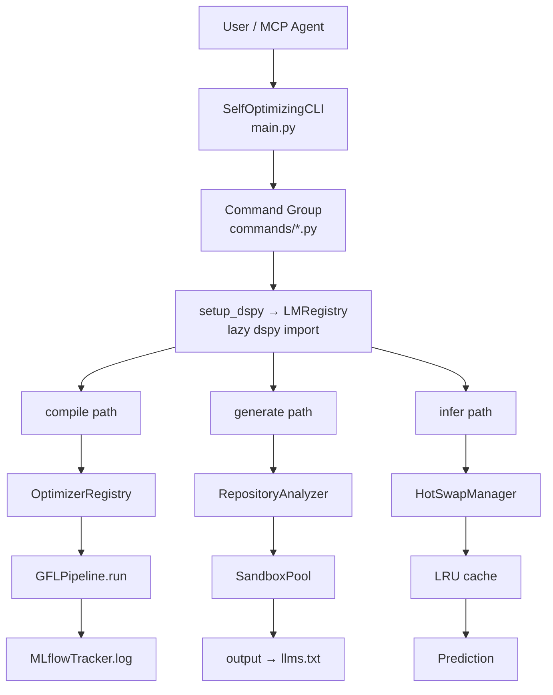

# Architecture

## Package Map

```
dspytools/
├── main.py                  CLI entry point (SelfOptimizingCLI)
├── commands/ (24 files)     Click subcommand groups
│   ├── compile.py           20+ optimizer commands + OptimizerRegistry factory
│   ├── generate.py          llms.txt generation (llms-txt, batch, explore)
│   ├── graph.py             FalkorDB graph management (status, query, migrate)
│   ├── skills.py            Skills system
│   ├── pipeline.py          Multi-step pipeline compose (compose, run, list, show)
│   ├── export.py            Program export (JSON, ONNX, Python)
│   ├── compare.py           Side-by-side program comparison + lineage
│   ├── distill.py           LoRA distillation pipeline (run, list-frameworks, stats, prepare-colab)
│   ├── doctor.py            System diagnostics (env, GPU, deps, config)
│   ├── lora.py              LoRA adapter management (load, unload, list, chat, test, health, discover)
│   └── ...
├── core/ (16 files)         Engine
│   ├── _dspy.py             Lazy DSPy import
│   ├── setup.py             LMRegistry singleton + setup_dspy
│   ├── hotswap.py           LRU cache HotSwapManager (refcounting, warm_swap, drain-safe swap)
│   ├── registry.py          JSON run index
│   ├── output.py            Run directory management
│   ├── scheduler.py         Async compile job queue
│   ├── mlflow_tracker.py    MLflow async logging
│   ├── cost_tracker.py      Token counting and cost estimation
│   ├── drift_monitor.py     Quality drift detection over time
│   ├── holdout.py           Holdout isolation gate (Invariant 5)
│   ├── loaders.py           Trainset/module/JSONL load helpers
│   ├── metrics.py           Shared DSPy metric factories (SSOT)
│   ├── retry.py             Auto-retry with exponential backoff
│   └── errors.py            Typed exception hierarchy
│   ├── mojo_bridge.py       Shared Mojo module loader (try_load_mojo)
│   └── logging_config.py    Centralized structlog structured logging
├── gfl/ (15 files)          Generative Feedback Loop
│   ├── pipeline.py          GFLPipeline (compare, single, halving, draft)
│   ├── paper_optimizers.py  SPIN, MetaPrompt, GEPA, LSE, GRAO, PurifiedOPSD
│   ├── consolidation.py     Trace2Skill: 3-stage pipeline (Rollout → Analyze → Consolidate)
│   ├── synthetic.py         DataSynthesizer + ChallengerSolver (R-Zero)
│   ├── tracker.py           LSETracker (delta improvement)
│   ├── ab_test.py           Statistical A/B testing
│   └── ...
├── generate/ (5 files)      llms.txt generation module
│   ├── module.py            RepositoryAnalyzer + SandboxPool
│   ├── data.py              Ground truth examples
│   ├── explorer.py          GitRepoExplorer + MCP tools
│   ├── cache.py             AST-based dependency caching
│   └── __init__.py
├── evolve/ (4+4 files)      Self-evolving agent system
│   ├── self_evolve.py       SelfEvolveEngine (Morphology, Transfer, UCB, SPRT)
│   ├── router.py            RouterAgent (ReAct + 6 tools)
│   ├── metrics.py           Evolution metrics tracking
│   └── layers/              H1 Action, H2 Contract, H3 Trajectory
├── graph/ (5 files)         FalkorDB graph database integration
│   ├── client.py            GraphClient singleton (FalkorDB + Redis)
│   ├── skill_graph.py       FalkorDBSkillGraph (dependencies, lineage)
│   ├── cache.py             RedisVL semantic cache
│   ├── migrate.py           JSON → FalkorDB migration
│   └── __init__.py
├── memory/ (2 files)        FalkorDB-native persistent memory
│   ├── manager.py           MemoryManager singleton (entity extraction, dedup)
│   └── __init__.py
├── mcp/ (4 files)           MCP server + tools
│   ├── server.py            Unified server (65 tools, 8+ resources, 3 prompts)
│   ├── tools.py             Tool handlers with response caching
│   ├── loader.py            MCPSessionPool
├── skills/ (4 files)        Agent Skills system
│   ├── manager.py           Skill lifecycle (create → compile → optimize)
│   ├── loader.py            BM25 + embedding hybrid search
│   ├── discovery.py         External skills ecosystem search (skills.sh)
│   └── __init__.py
├── help/ (4 files)          Self-optimizing --help
├── api/ (1 file)            FastAPI hot-swap server
├── config/ (2 files)        Config management + .env
└── cli/ (1 file)            Rich output utilities
```

## Data Flow



## Structured Logging

`core/logging_config.py` provides centralized structlog-based structured logging via `get_logger(__name__)` — the standard logger accessor for all dspytools modules. Key design:

- **Single entry point**: `get_logger(__name__)` auto-configures on first use
- **Dual output**: Console (colored) in dev, JSON in production (`DSPYTOOLS_ENV=production`)
- **Stdlib integration**: Existing `logging.getLogger()` calls render through structlog pipeline
- **Log level via env**: `DSPYTOOLS_LOG_LEVEL` (default INFO)
- **Third-party noise suppression**: urllib3, httpx, litellm, falkordb, redis set to WARNING

## Mojo Bridge

`core/mojo_bridge.py` provides a shared `try_load_mojo(module_name, attr_name, logger)` utility that eliminates 17-line boilerplate duplicated across 3 bridge files (`bm25_mojo_bridge.py`, `cache_mojo_bridge.py`, `sprt_mojo_bridge.py`). Key design:

- Single shared loader — all 3 bridges delegate to one implementation
- Returns `(HAS_MOJO: bool, module: ModuleType | None)` tuple
- Auto-inserts `mojo_modules/` into `sys.path`
- Logs availability via the caller's logger instance

## Cost Tracking

`core/cost_tracker.py` tracks LM token usage and cost per call. Every compile and inference is logged with:
- Input/output tokens per model
- Estimated dollar cost (configurable per-model pricing)
- Aggregated stats per `run_id` and per pipeline step

Access via `dspytools compile cost <run-id>` or the `compile_cost` MCP tool.

## Drift Detection

`core/drift_monitor.py` stores quality snapshots for compiled programs and alerts when scores degrade below baseline. Features:
- Per-program quality baseline at compile time
- Configurable drift threshold (default: 10% drop)
- History storage (last N snapshots per program)
- Warning at 5% degradation, critical at 15%
- Critical alerts trigger `request_recompile()` for automatic recompilation queue
- CLI: `dspytools self auto-fix --no-dry-run --auto-fix` processes pending recompiles
- MCP tools: `drift_status`, `drift_history`, `drift_auto_fix`

## Holdout Gate

`core/holdout.py` enforces **Invariant 5**: holdout data is split before any compile call and never seen by the optimizer. The gate:
- Splits trainset into train + holdout before each compile
- Stores splits by fingerprint to ensure consistency across retries
- Blocks compile if no holdout partition exists
- MCP tool: `holdout_status` to inspect stored splits

## Typed Exceptions

`core/errors.py` provides a structured exception hierarchy:
- `DspyToolsError` — base for all dspytools exceptions
- `ServiceUnavailableError` → `CacheError` (Redis), `GraphError` (FalkorDB), `LlamaCppError` (llama-cpp-server)
- `CompileError` — optimizer/module failures with original cause
- `ValidationError`, `ConfigError`, `RateLimitError`
- All nest under `DspyToolsError` for clean catch-all

## Idempotency

`core/registry.py` computes deterministic `compute_idempotency_key(module_name, dataset_hash, optimizer)` for safe recompilation without duplicates. Failed runs are skipped on retry.

## Caching

`generate/cache.py` provides an AST-based dependency cache for repository analysis. Key design:
- Keys are SHA-256 hashes of file dependency trees
- Values are serialized analysis results (file tree, readme, packages)
- Two-tier: in-memory (fast) + disk (persistent across sessions)
- TTL-based expiration with manual invalidation
- MCP tools: `cache_stats`, `cache_invalidate`

## Graph Database (FalkorDB)

`graph/` provides O(1) graph traversal for skill dependencies and program lineage via FalkorDB.

### Components

- **`client.py`** — `GraphClient` singleton wrapping FalkorDB (Cypher) + Redis (vector search, caching)
- **`skill_graph.py`** — `FalkorDBSkillGraph` with add/remove dependency, transitive queries, task profiles, program lineage
- **`cache.py`** — `SemanticCache` using RedisVL for LLM response caching (cosine similarity)
- **`migrate.py`** — Migration utilities to import existing JSON data into FalkorDB

### Key Design

- **Single container**: Redis Stack with FalkorDB module (port 6379)
- **Sub-140ms p99 latency**: 335x faster than Neo4j for graph queries
- **<100MB memory**: Lightweight footprint for edge deployment
- **Cypher queries**: Full FalkorDB/Cypher support for complex graph traversals

### MCP Tools

- `graph_query` — Execute Cypher queries
- `graph_skill_tree` — List all skills in graph
- `graph_program_lineage` — Show program ancestry chain
- `graph_stats` — Get graph statistics

## Persistent Memory (FalkorDB-native)

`memory/` provides FalkorDB-native persistent memory layer with automatic entity extraction, deduplication, semantic search, and graph-based memory relationships. No mem0 dependency — uses FalkorDB graph + Redis vector embeddings directly.

### Components

- **`manager.py`** — `MemoryManager` singleton with FalkorDB graph storage and FalkorDB native vector index

### Key Design

- **Entity extraction**: Automatic indexing by entities
- **Deduplication**: Prevents duplicate memories
- **Conflict resolution**: Merges contradictory information
- **Semantic search**: Find relevant memories by meaning
- **Multi-tenant**: user_id, agent_id, run_id isolation

### MCP Tools

- `memory_add` — Add a memory
- `memory_search` — Search memories semantically
- `memory_get_all` — Get all memories for a user
- `memory_delete` — Delete a memory

## Semantic Cache (RedisVL)

`graph/cache.py` provides LLM response caching by semantic similarity.

### Key Design

- **Cosine similarity matching**: Finds semantically similar prompts
- **Configurable threshold**: Tune precision vs recall (default: 0.1)
- **TTL expiration**: Auto-invalidate stale entries (default: 1 hour)
- **Cache statistics**: Track hit rate and memory usage

### MCP Tools

- `cache_check` — Check if prompt has cached response
- `cache_store` — Store prompt-response pair
- `cache_stats` — Get cache statistics
- `cache_clear` — Clear all cached entries

## Key Invariants

1. **Lazy DSPy import**: Never `import dspy` directly — use `from dspytools.core._dspy import dspy`
2. **Teacher LM only for optimization**: `LMRegistry.get_teacher()` only in GEPA/distill/finetune paths
3. **Student LM for inference**: `LMRegistry.get_or_default()` for `dspy.configure()`
4. **No try/except around imports**: All packages are hard dependencies
5. **Holdout never seen by optimizer**: `split_holdout()` before any compile call
