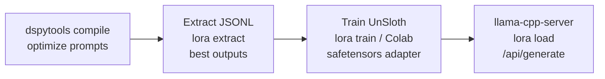
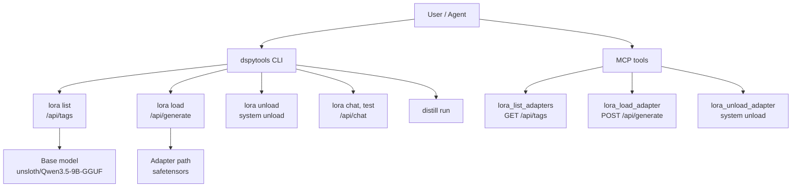

# LoRA Integration

Full LoRA adapter lifecycle — **extraction → training → serving → management** — integrated into the dspytools CLI and MCP tool set.

All LoRA operations target **llama-cpp-server** at `http://127.0.0.1:8080` (configurable via `DSPYTOOLS_LLAMA_CPP_URL`). No separate LoRA server needed.

## Overview



## Quick Start

### 1. Ensure llama-cpp-server is running

```bash
# llama-cpp-server should be running on port 8080
# Verify connection
dspytools lora health
```

### 2. Extract training data from a compiled DSPy program

```bash
# After compiling a program:
dspytools lora extract <run-id> --devset devset.json --min-score 0.5
# → produces extracted_<run-id>.jsonl
```

### 3. Train a LoRA adapter

```bash
# Local training (if GPU available with Unsloth installed)
dspytools lora train my-adapter --data output/extracted_<run-id>.jsonl --rank 64

# Or stage for Colab
dspytools lora train my-adapter --data output/extracted_<run-id>.jsonl --colab
```

### 4. Load adapter into llama-cpp-server

```bash
# Loads the adapter via /api/generate with adapter path
dspytools lora load my-adapter
```

### 5. Test and evaluate

```bash
# Quick test
dspytools lora test my-adapter

# Interactive chat
echo "Write a Python context manager" | dspytools lora chat my-adapter

# A/B evaluate: compiled program vs LoRA model
dspytools lora evaluate my-adapter --compiled <run-id> --testset devset.json
```

### 6. List and unload

```bash
dspytools lora list
dspytools lora unload my-adapter
```

## How llama-cpp-server LoRA Works

llama-cpp-server handles LoRA via adapter paths passed to the `/api/generate` endpoint:

1. **`lora load`** sends `POST /api/generate` with the base model and adapter path:
   ```json
   {
     "model": "unsloth/Qwen3.5-9B-GGUF",
     "adapter": "/path/to/adapter",
     "prompt": "{{ .Prompt }}",
     "stream": false
   }
   ```
2. The adapter name is `{base}-lora-{name}` (e.g., `Qwen3.5-9B-lora-super`)
3. Inference uses `POST /api/chat` with the model name
4. **`lora unload`** unloads the adapter (llama-cpp-server has no delete endpoint — uses system command)
5. llama-cpp-server caches the model in VRAM

**No hot-swap API** — llama-cpp-server loads/unloads adapters via generate endpoint. This is the supported path.

## CLI Reference

### `dspytools lora`

| Command | Description |
|---------|-------------|
| `list` | List all models in llama-cpp-server (base + LoRA-derived) |
| `load <name> [path]` | Load LoRA adapter into llama-cpp-server via `/api/generate` |
| `unload <name>` | Unload LoRA adapter from llama-cpp-server |
| `chat <name>` | Chat with LoRA model via llama-cpp-server `/api/chat` |
| `test <name>` | Quick code generation test |
| `health` | llama-cpp-server version, running models, VRAM, LoRA models |
| `discover [dir]` | Find safetensors adapters in directory |
| `extract <run-id>` | Extract best DSPy outputs as JSONL (uses exact_match metric) |
| `evaluate <adapter>` | A/B evaluate LoRA model vs compiled program |
| `train <name>` | Train LoRA adapter from JSONL (local Unsloth or Colab) |

### `dspytools distill`

| Command | Description |
|---------|-------------|
| `run` | Run distillation pipeline |
| `list-frameworks` | List configurable frameworks |
| `stats [file]` | Show JSONL statistics |
| `prepare-colab` | Stage files for Colab training |

## MCP Tools

Available in the unified MCP server (`dspytools mcp serve`):

| Tool | llama-cpp API | Description |
|------|---------------|-------------|
| `lora_list_adapters` | `GET /api/tags` | List LoRA-derived models in llama-cpp-server |
| `lora_load_adapter` | `POST /api/generate` | Load adapter with adapter path parameter |
| `lora_unload_adapter` | system unload | Unload adapter (no delete endpoint) |

## Closed-Loop Workflow

```bash
# 1. Compile a DSPy program
dspytools compile mipro MyModule trainset.json --label my-optimized
# → produces compiled/<run_id>/

# 2. Extract best outputs as LoRA training data
dspytools lora extract <run-id> --devset devset.json --min-score 0.5
# → produces output/extracted_<run-id>.jsonl

# 3. Train a LoRA adapter
dspytools lora train my-adapter --data output/extracted_<run-id>.jsonl --rank 64

# 4. Load into llama-cpp-server
dspytools lora load my-adapter

# 5. A/B evaluate
dspytools lora evaluate my-adapter --compiled <run-id> --testset devset.json
```

## Architecture



## Configuration

- **llama-cpp-server URL**: `DSPYTOOLS_LLAMA_CPP_URL` env var (default: `http://127.0.0.1:8080`)
- **Base model**: Read from `config["lm"]["student"]["model"]` (set via `dspytools configure set`)
- **Adapter storage**: `~/.config/dspytools/adapters/` (env: `DSPYTOOLS_ADAPTERS_DIR`)
- **Training output**: `~/.config/dspytools/distill/`

## Dependencies

- **llama-cpp-server** running locally with the base model loaded
- **Unsloth** for local training (`pip install unsloth`) — optional, falls back to Colab
- **OpenRouter API key** in `.env` for distillation (optional, only for `distill run`)
