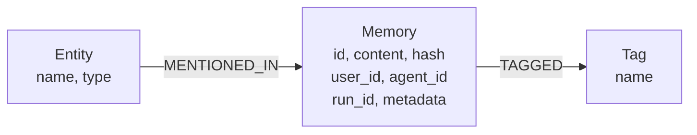

# DOX — memory

## Purpose

FalkorDB-native persistent memory layer for dspytools. Provides automatic entity extraction, deduplication, semantic search, and graph-based memory relationships. No mem0 dependency — uses FalkorDB graph + Redis vector embeddings directly.

**Integrated into SelfEvolveEngine:** `on_compile()` stores optimization lessons as memories; `suggest_optimizer()` searches memories for past insights before falling back to morphology/UCB.

**Integrated into SelfEvolveEngine:** `on_compile()` stores optimization lessons as memories; `suggest_optimizer()` searches memories for past insights before falling back to morphology/UCB.

## Ownership

- `MemoryManager` — singleton FalkorDB memory interface with lazy initialization
- `get_memory_manager()` — cached module-level singleton accessor

## Local Contracts

### `manager.py` — MemoryManager

- `MemoryManager()` — singleton via `__new__`, lazy FalkorDB init
- `add(content, user_id, agent_id, run_id, metadata)` → dict — adds memory with dedup, entity extraction, tagging, and embedding
- `add_batch(entries, user_id)` → list[dict] — batch add multiple memories (reuses shared embedder)
- `search(query, user_id, agent_id, limit)` → list[dict] — two-tier search: semantic (FalkorDB native vector index via `db.idx.vector.queryNodes`, O(log N)) + graph (entity/tag traversal)
- `get_all(user_id, agent_id)` → list[dict] — all memories for user
- `get(memory_id)` → dict | None — specific memory
- `update(memory_id, content)` → dict — update content + re-embed
- `delete(memory_id)` → dict — delete memory + embeddings
- `delete_all(user_id, agent_id)` → dict — delete all for user/agent
- `history(memory_id)` → list[dict] — memory history (current state)
- `reset()` — clear all memories, entities, tags, embeddings
- `stats(user_id)` → dict — memory statistics

### Graph Schema

### Deduplication

- Content hash (SHA-256 truncated to 16 chars) checked before insert
- Same content for same user returns existing ID with `deduplicated: true`

### Two-Tier Search

1. **Semantic**: FalkorDB native vector index (`db.idx.vector.queryNodes` on `Memory.embedding`) → O(log N) cosine similarity. Score = distance (lower = more similar). Vectors stored as `vecf32()` on Memory nodes.
2. **Graph**: FalkorDB entity/tag traversal for related memories

## Work Guidance

- Always use `get_memory_manager()` for memory access
- User ID defaults to "dspytools" for global memory
- Agent ID and run ID enable per-agent and per-run memory isolation
- Memory is deduplicated automatically by content hash
- Embeddings stored in Redis with 30-day TTL

## Verification

- `dspytools graph status` — checks Redis/FalkorDB connection
- MCP tools: `memory_add`, `memory_search`, `memory_get_all`, `memory_delete`
